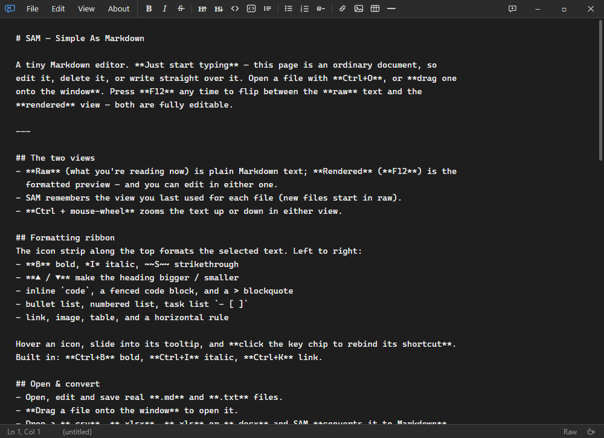
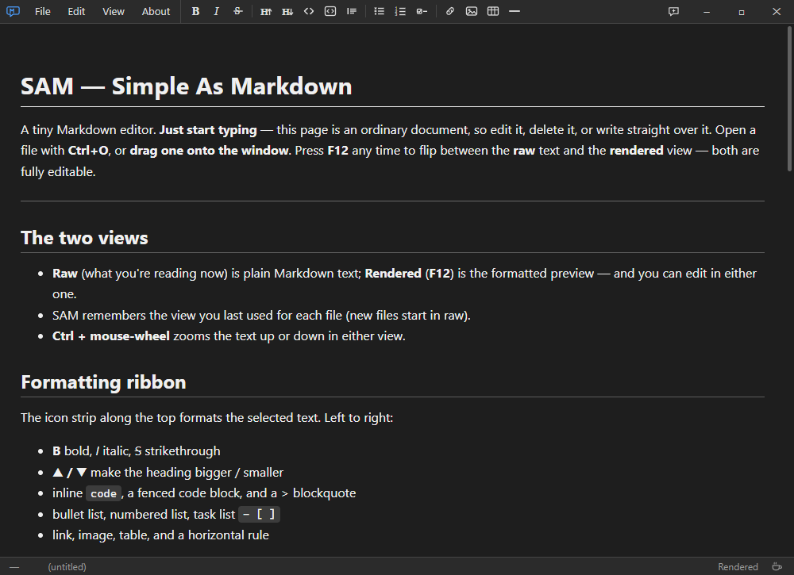
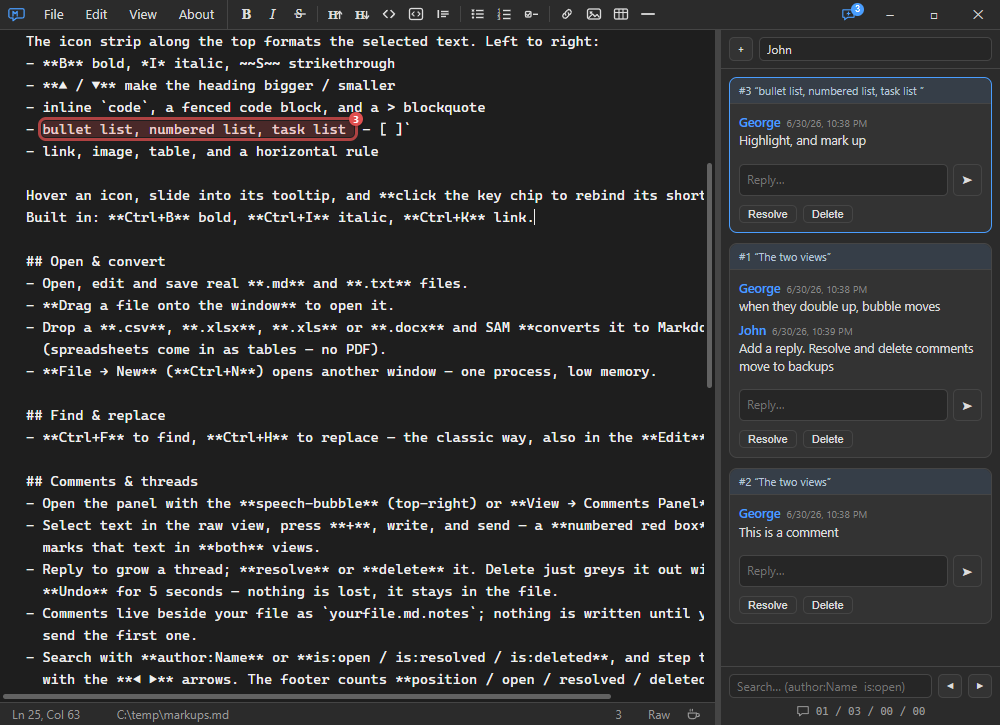
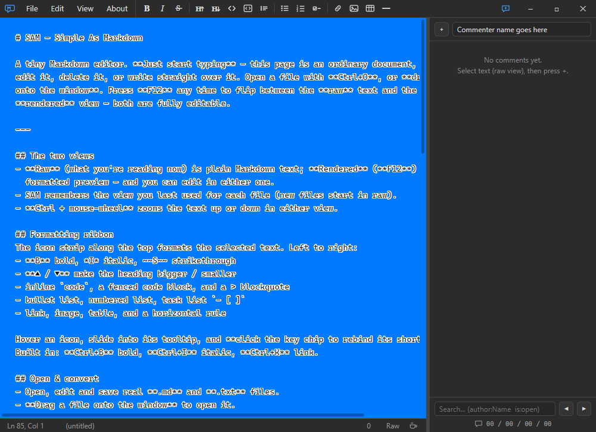

# SAM — Simple As Markdown

A ridiculously simple desktop Markdown viewer/editor. Open a `.md` file and edit it
in **either view** — raw text or the rendered "rich" view (both editable) — format
with an icon ribbon, leave **comments**, pick any background colour, and flip on a
**high-visibility** halo so your text never vanishes, even when the text colour
matches the background.

Built on Electron, so it bundles its own Chromium and behaves the same on Windows,
macOS and Linux.

## Features

- **Two editable views** — raw ASCII and an `F12` rendered view; the rich view
  round-trips back to Markdown (via Turndown) only when you actually edit it.
- **Formatting ribbon** — bold / italic / strike, `H▲`/`H▼` headings, inline &
  fenced code, quotes, bullet / numbered / task lists, links, images, tables, rules
  — with hover tooltips and fully **rebindable shortcuts**.
- **Comments & threads** — select text and leave a threaded comment; a numbered red
  box marks it in **both** views. Stored beside the file as `<name>.md.notes` (only
  written once you send the first comment), with replies, resolve / delete, an
  author/`is:` search, and live re-anchoring that survives edits (fuzzy match, falls
  back to an "orphan" rather than mis-placing). Watched live — flashes if a comment
  arrives while you're away.
- **Open & convert** — open / edit / save `.md` and `.txt`; **drag a file onto the
  window** to open it, or drop a `.csv`, `.xlsx`, `.xls` or `.docx` to **convert it to
  Markdown** (spreadsheets become tables). All converters vendored & offline.
- **Find & Replace** — classic Notepad-style `Ctrl+F` / `Ctrl+H`, match-case & wrap.
- **High-visibility mode** — a 1px halo around every glyph (the whole reason this
  exists), with automatic black/white text contrast for any background colour.
- **Ctrl + mouse-wheel zoom** in either view; copy strips SAM's text colour so it
  pastes in the destination's colour.
- **Frameless and native-feeling** — in-app menus, a clickable logo window-menu,
  custom minimise / maximise / close, a drag region, and themed in-app dialogs.
- **One process, many windows** — low memory; `File → New` opens another window.
- **Word wrap**, a status bar (Ln/Col, dirty marker, smart middle-ellipsis path,
  comment counter), **Keep on Top** (`F11`, with optional dim-when-unfocused), and a
  per-file memory of which view you last used.
- **External-change watch** — Notepad++-style: if the file changes on disk it offers
  to reload, with a per-file "don't ask again".
- **Robust settings** — `%APPDATA%/SAM/settings.json`, validated and self-healing;
  **nothing listens on a socket**.

## Screenshots

> Screenshots live in **`docs/screenshots/`** — drop in PNGs with the filenames below and
> they render here (and in the hero up top). Use any subset; delete a line for shots you skip.

| Raw view | Rendered view |
| :---: | :---: |
|  |  |

| Comments &amp; threads | High-visibility mode |
| :---: | :---: |
|  |  |

## Run from source

```sh
npm install
npm start              # or:  npm start -- path/to/file.md
```

## Build & releases

Prebuilt **Windows** binaries (portable `SAM.exe` + installer) are on the
[Releases](https://github.com/t-n-z/SAM/releases) page. **macOS** and **Linux** aren't
published yet — build them from source. electron-builder can only build a given OS *on* that
OS, so each is built natively (or via a CI runner for that platform):

### Windows
```sh
npm run dist:both       # portable SAM.exe + unpacked folder
npm run dist:installer  # NSIS installer (SAM Setup <version>.exe)
npm run dist:all        # all targets
```

### macOS — build on a Mac
```sh
npm run dist:mac        # .dmg + .zip
```
Not code-signed yet, so Gatekeeper may block the first launch: **right-click the app → Open**
(or run `xattr -dr com.apple.quarantine SAM.app`). A signed / notarised build needs an Apple
Developer account.

### Linux — build on Linux (or WSL)
```sh
npm run dist:linux      # AppImage + .deb
```
Make the AppImage runnable, then launch it: `chmod +x SAM-*.AppImage && ./SAM-*.AppImage`.

Artifacts land in `dist/`.

## Diagnostics

SAM logs **only when armed**. Start the devlogger first (`npm run devlog`, or run a
copy of the exe named `devlogger.exe`): it drops a sentinel that enables file logging
and tails it live. No devlogger running means no logging and no network surface.

## How it's built

Electron main process (`main.js`) + a context-isolated preload bridge (`preload.js`,
exposed as `window.sam`) + a plain HTML/CSS/JS UI in `web/`. Markdown is rendered with
**marked**, sanitised with **DOMPurify**, and converted back with **Turndown**;
imports use **PapaParse** (CSV), **SheetJS** (XLS/XLSX) and **Mammoth** (DOCX). The
raw editor is a `contenteditable` div whose comment highlights are drawn from real
layout geometry (`Range.getClientRects()`), and comments live in a small sidecar
format with self-healing text anchoring. Everything is vendored and offline — no CDN
at runtime, and nothing listens on a socket.

## License

[MIT](LICENSE) © 2026 t-n-z
